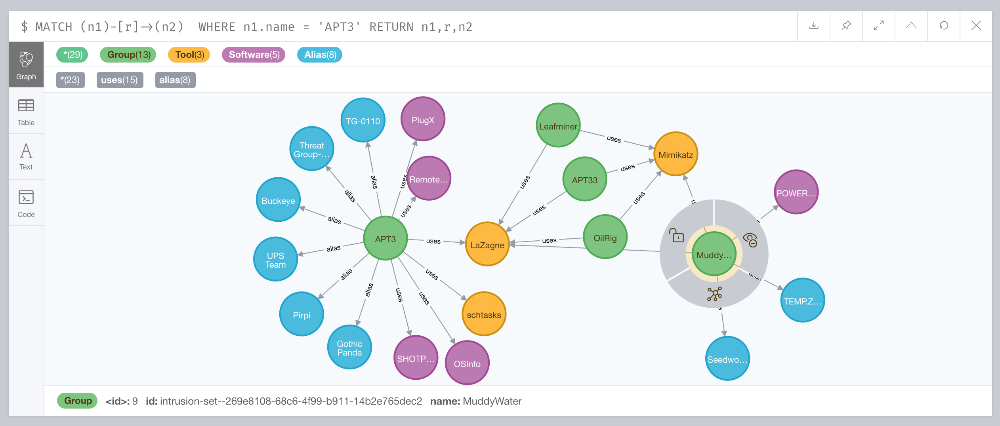
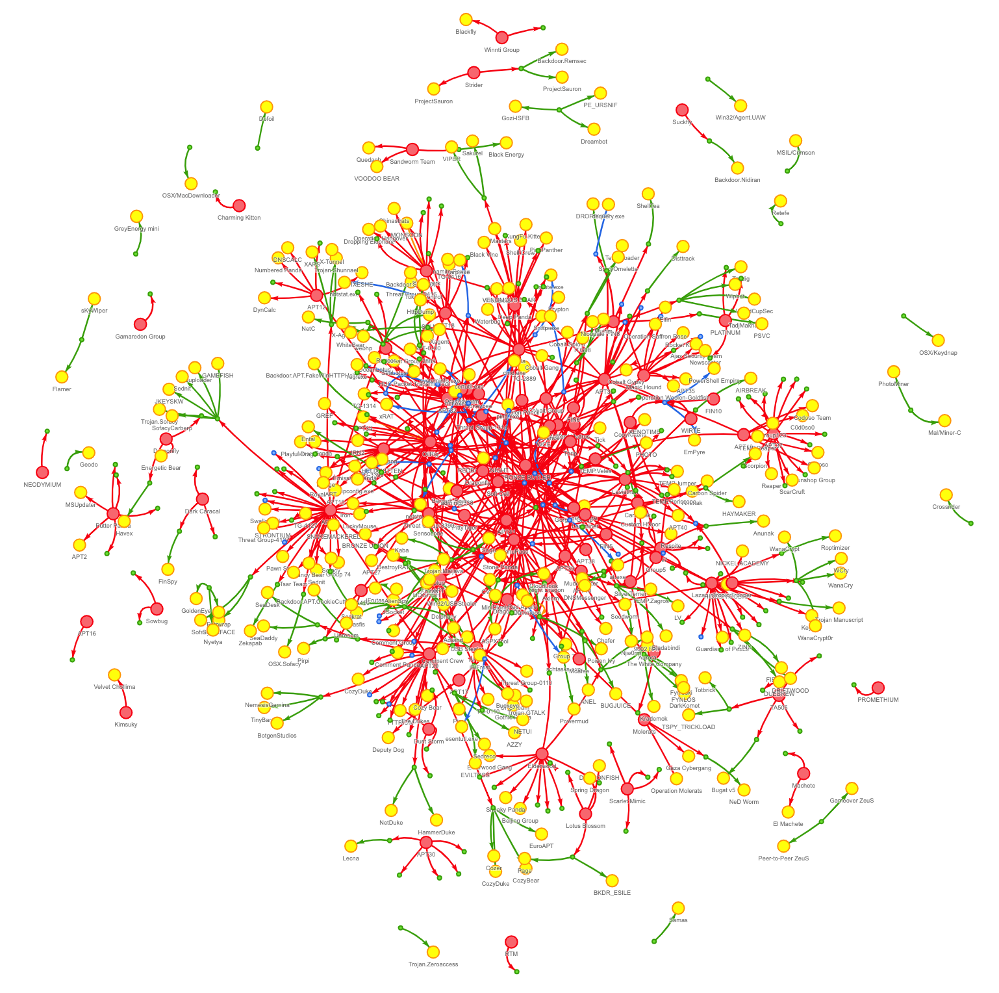

# attack2neo
Import Mitre Entreprise Att&amp;ck data into Neo4j database

## Purpose 
Purpose of this very simple tool is to :
- read JSON data from Mitre Att&amp;ck - https://attack.mitre.org/
- import data into Neo4j database - https://neo4j.com/

This small project has been first been developed to easily 
query Mitre Att&amp;ck data using Cypher Query Language.

## Requirements
Following python modules are required :
- [py2neo v4](https://py2neo.org/v4/)

Modules could be installed using following commands:
```
$ pip install -r requirements.txt
```
## Configuration
Settings have to be defined directly into python script :
```
# open graph connection
graph_bolt = "bolt://127.0.0.1:7687"
graph_auth = ("neo4j","test")
```
Custom settings according to your Neo4j installation:
- `graph_bolt` contains connection details provided using URIs such as `bolt://<ip_address>:<port>`
- `graph_auth` contains a 2-tuple of (`<user>`,`<password>`) to connect to Neo4j database

## Usage
```
usage: attack2neo.py [-h] [-d] -f <filename> [-g] [-s] [-o] [-t] [-r]

optional arguments:
  -h, --help        show this help message and exit
  -d, --debug       enter debug mode
  -f <filename>     input file name
  -g, --groups      import Groups objects (type:intrusion-set)
  -s, --softwares   import Softwares objects (type:malware)
  -o, --tools       import Tools objects (type:tool)
  -t, --techniques  import Techniques objects (type:attack-pattern and
                    type:course-of-action)
  -r, --relations   import Relations objects (type:relationship)
```
where <filename> contains JSON data from Mitre Att&amp;ck

## Mitre Att&amp;ck database
The Mitre Entreprise Atta&amp;ck database in JSON format could be
found out at [Mitre CTI Github](https://github.com/mitre/cti/blob/master/enterprise-attack/enterprise-attack.json)

## Sample
Let's first import data from Mitre Entreprise Att&amp;ck:
```
$ ./attack2neo.py --debug -f mitre-enterprise-attack.json --groups --softwares --tools --relations
[...]
Group: "Dragonfly 2.0" -[alias]-> "Berserk Bear"
Group: "Dust Storm"
Group: "Elderwood" -[alias]-> "Elderwood Gang" -[alias]-> "Beijing Group" -[alias]-> "Sneaky Panda"
[...]
Software: "BUBBLEWRAP" -[alias]-> "Backdoor.APT.FakeWinHTTPHelper"
Software: "BabyShark"
Software: "Backdoor.Oldrea" -[alias]-> "Havex"
[...]
Tool: "Pass-The-Hash Toolkit"
Tool: "Ping" -[alias]-> "ping.exe"
Tool: "PoshC2"
[...]
Relation: "FIN5" -[uses]-> "PsExec"
Relation: "DarkHydrus" -[uses]-> "Cobalt Strike"
Relation: "Leviathan" -[uses]-> "BITSAdmin"
[...]
```

Then, we can query Neo4j database using Neo4j Browser:



## Visualization
Under `visualization` folder, there are files `attack2neo.html` and `attack2neo.js` to provide simple HTML tool to visualize your Neo4j Cypher queries using [neovis.js](https://github.com/neo4j-contrib/neovis.js) library.

Settings have to be defined directly into javascript file :
```
server_url: "bolt://localhost:7687",
server_user: "neo4j",
server_password: "test",
initial_cypher: "MATCH (n)-[r]-(m) RETURN n,r,m"
```
Custom settings according to your Neo4j installation:
- `server_url` contains connection details provided using URIs such as `bolt://<ip_address>:<port>`
- `server_user` contains user value to connect to Neo4j database
- `server_password` contains password value to connect to Neo4j database
- `initial_cypher` contains Cypher query to be run



## Queries samples
Find aliases for group "APT18":
```
MATCH (g:Group {name:"APT18"}) 
WITH g MATCH (g) - [:alias] -> (a:Alias)
RETURN g.name AS Name, a AS Alias

╒═══════╤════════════════════════════╕
│"Name" │"Alias"                     │
╞═══════╪════════════════════════════╡
│"APT18"│{"name":"Threat Group-0416"}│
├───────┼────────────────────────────┤
│"APT18"│{"name":"Dynamite Panda"}   │
├───────┼────────────────────────────┤
│"APT18"│{"name":"TG-0416"}          │
└───────┴────────────────────────────┘
```
Find groups who are using software "ASPXSpy":
```
MATCH (s:Software)
WHERE s.name = "ASPXSpy" 
WITH s MATCH (s) <- [:uses] - (g:Group)
RETURN s.name AS Software, g.name AS Group

╒══════════╤═══════════════════╕
│"Software"│"Group"            │
╞══════════╪═══════════════════╡
│"ASPXSpy" │"APT41"            │
├──────────┼───────────────────┤
│"ASPXSpy" │"APT39"            │
├──────────┼───────────────────┤
│"ASPXSpy" │"Night Dragon"     │
├──────────┼───────────────────┤
│"ASPXSpy" │"Threat Group-3390"│
└──────────┴───────────────────┘
```

Find groups - and their aliases - who are using software "BISCUIT":
```
MATCH (s:Software {name:"BISCUIT"}) <-[*1..2]-> (g:Group)
RETURN s.name AS Software, g.name AS Group

╒══════════╤═══════════════╕
│"Software"│"Group"        │
╞══════════╪═══════════════╡
│"BISCUIT" │"APT1"         │
├──────────┼───────────────┤
│"BISCUIT" │"Comment Crew" │
├──────────┼───────────────┤
│"BISCUIT" │"Comment Group"│
├──────────┼───────────────┤
│"BISCUIT" │"Comment Panda"│
└──────────┴───────────────┘
```

Find all about a specifc group:
```
MATCH (n)-[r]-(m)
WHERE n.name='APT1'
RETURN n.name, TYPE(r), LABELS(m), m.name

╒════════╤═════════╤═════════════════╤═══════════════════════╕
│"n.name"│"TYPE(r)"│"LABELS(m)"      │"m.name"               │
╞════════╪═════════╪═════════════════╪═══════════════════════╡
│"APT1"  │"uses"   │["Software"]     │"Seasalt"              │
├────────┼─────────┼─────────────────┼───────────────────────┤
│"APT1"  │"uses"   │["Software"]     │"PoisonIvy"            │
├────────┼─────────┼─────────────────┼───────────────────────┤
│"APT1"  │"uses"   │["Tool"]         │"xCmd"                 │
├────────┼─────────┼─────────────────┼───────────────────────┤
│"APT1"  │"uses"   │["Software"]     │"WEBC2"                │
├────────┼─────────┼─────────────────┼───────────────────────┤
│"APT1"  │"uses"   │["Tool"]         │"Cachedump"            │
├────────┼─────────┼─────────────────┼───────────────────────┤
│"APT1"  │"uses"   │["Tool"]         │"Pass-The-Hash Toolkit"│
├────────┼─────────┼─────────────────┼───────────────────────┤
│"APT1"  │"uses"   │["Tool"]         │"PsExec"               │
├────────┼─────────┼─────────────────┼───────────────────────┤
│"APT1"  │"uses"   │["Tool"]         │"Net"                  │
├────────┼─────────┼─────────────────┼───────────────────────┤
│"APT1"  │"uses"   │["Tool"]         │"gsecdump"             │
├────────┼─────────┼─────────────────┼───────────────────────┤
│"APT1"  │"uses"   │["Software"]     │"BISCUIT"              │
├────────┼─────────┼─────────────────┼───────────────────────┤
│"APT1"  │"uses"   │["Tool"]         │"Lslsass"              │
├────────┼─────────┼─────────────────┼───────────────────────┤
│"APT1"  │"uses"   │["Tool"]         │"Mimikatz"             │
├────────┼─────────┼─────────────────┼───────────────────────┤
│"APT1"  │"uses"   │["Tool"]         │"ipconfig"             │
├────────┼─────────┼─────────────────┼───────────────────────┤
│"APT1"  │"uses"   │["Tool"]         │"Tasklist"             │
├────────┼─────────┼─────────────────┼───────────────────────┤
│"APT1"  │"uses"   │["Software"]     │"GLOOXMAIL"            │
├────────┼─────────┼─────────────────┼───────────────────────┤
│"APT1"  │"uses"   │["Tool"]         │"pwdump"               │
├────────┼─────────┼─────────────────┼───────────────────────┤
│"APT1"  │"uses"   │["Software"]     │"CALENDAR"             │
├────────┼─────────┼─────────────────┼───────────────────────┤
│"APT1"  │"alias"  │["Alias","Group"]│"Comment Panda"        │
├────────┼─────────┼─────────────────┼───────────────────────┤
│"APT1"  │"alias"  │["Alias","Group"]│"Comment Group"        │
├────────┼─────────┼─────────────────┼───────────────────────┤
│"APT1"  │"alias"  │["Alias","Group"]│"Comment Crew"         │
└────────┴─────────┴─────────────────┴───────────────────────┘
```

See [Neo4j's Cypher queries cheatsheet](https://gist.github.com/DaniSancas/1d5265fc159a95ff457b940fc5046887) to get some Neo4j and Cypher fundamentals.


